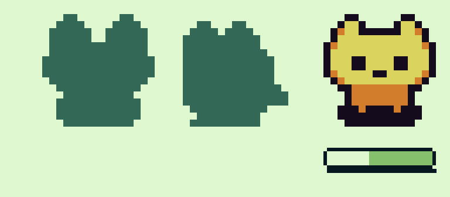

  <picture>
    <source media="(prefers-color-scheme: dark)" srcset="../02-brand/logo/svg/on-dark/lockup-fa-horizontal.svg">
    
  </picture>

# پرسشنامه‌ی تحقیق کاربر

**نسخه:** ۰.۵ (منتظر بازبینی طراح) · **مرحله:** ۴ از ۱۳ · **ابزار:** پرسلاین · **زمان پاسخ:** حدود ۶ دقیقه

> این سند متن کامل پرسشنامه برای ساخت در پرسلاینه، به‌اضافه‌ی هدف هر سؤال و نحوه‌ی تحلیلش. ستون «هدف» فقط برای ماست و به پاسخ‌دهنده نشون داده نمی‌شه. برنامه‌ی کلی و معیارهای تصمیم در [برنامه‌ی تحقیق](research-plan.md) هستن.

---

## ۱. راهنمای ساخت در پرسلاین

| تنظیم | مقدار | چرا |
|---|---|---|
| پلن | رایگان | سقف ۱۰۰ پاسخ در ماه؛ هدف ما ۳۰ تا ۸۰ پاسخه |
| شرط و پرش | **استفاده نمی‌شه** | جزو امکانات پولیه؛ پرسشنامه خطی طراحی شده و هر سؤال گزینه‌ای برای کسی که بهش مربوط نیست داره |
| نمایش | یک سؤال در هر صفحه، با نوار پیشرفت | روی موبایل راحت‌تره و ریزش کمتره |
| اجباری | همه‌ی سؤال‌های بسته اجباری؛ سؤال‌های باز و راه تماس اختیاری | داده‌ی کامل برای تحلیل، بدون فشار برای نوشتن |
| ترتیب گزینه‌ها | ثابت، همون ترتیب این سند | گزینه‌های «نمی‌دونم» و «هیچ‌کدوم» آخر می‌مونن |
| متن توضیحی | قبل از بخش «د» یک صفحه‌ی متنی (بدون سؤال) | توضیح ایده‌ی اپ |
| پایلوت | ۲ یا ۳ نفر، قبل از انتشار | پیدا کردن سؤال‌های نامفهوم؛ جواب‌های پایلوت حذف بشن |
| لحن | نیمه‌رسمی، با «شما» | مخاطب‌ها سن‌های مختلفی دارن و پرسشنامه بدون برنده؛ لحن خودمونی «تو» مخصوص خود اپه ([پلتفرم برند](../02-brand/brand-platform.md)). مثال داخل اپ («امروز دویدی؟») با لحن اپ می‌مونه |

⚠️ قبل از انتشار، **بازه‌های قیمت سؤال Q23** با قیمت‌های امروز (مثلاً اشتراک ماهانه‌ی فیلیمو) مقایسه بشن و اگه لازمه به‌روز بشن.

---

## ۲. صفحه‌ی خوش‌آمد

> **سلام**
>
> در حال طراحی اپلیکیشنی برای ساختن عادت‌های روزانه هستم و می‌خواهم از تجربه‌ی واقعی شما یاد بگیرم.
>
> - پاسخ دادن حدود ۶ دقیقه طول می‌کشد.
> - پرسشنامه بی‌نام است. نام و شماره‌ی شما پرسیده نمی‌شود، مگر اینکه در پایان خودتان بخواهید.
> - پاسخ درست و غلط وجود ندارد. لطفاً آنچه واقعاً هست را انتخاب کنید، حتی اگر تا حالا عادتی نساخته‌اید.

---

## ۳. سؤال‌ها

### بخش الف: درباره‌ی شما

| # | سؤال | نوع | گزینه‌ها | هدف |
|---|---|---|---|---|
| Q1 | سن شما در کدام بازه است؟ | تک‌انتخابی | زیر ۱۸ · ۱۸ تا ۲۴ · ۲۵ تا ۳۴ · ۳۵ تا ۴۴ · ۴۵ به بالا | توصیف نمونه |
| Q2 | در حال حاضر بیشتر وقت شما صرف چه کاری می‌شود؟ | تک‌انتخابی | درس · کار تمام‌وقت · کار پاره‌وقت یا آزاد · خانه‌داری · در جست‌وجوی کار · سایر | توصیف نمونه؛ گروه دانشجوها (شروع مهر) |
| Q3 | برند گوشی شما چیست؟ | تک‌انتخابی | سامسونگ · شیائومی (یا ردمی و پوکو) · هوآوی یا آنر · آیفون · سایر اندرویدها · نمی‌دانم | H4 (راهنمای باتری)؛ سهم iOS در مخاطب (D-002) |

### بخش ب: تجربه‌ی شما با عادت‌ها

| # | سؤال | نوع | گزینه‌ها | هدف |
|---|---|---|---|---|
| Q4 | در ۱۲ ماه گذشته تلاش کرده‌اید عادت تازه‌ای بسازید یا کاری را به‌طور منظم انجام دهید؟ | تک‌انتخابی | بله، چند بار · بله، یک بار · خیر، ولی دوست دارم · خیر، و فعلاً برنامه‌ای ندارم | RQ2: کاربران پیشرو |
| Q5 | این عادت‌ها (یا عادتی که دوست دارید بسازید) در چه زمینه‌ای بودند؟ | چندانتخابی | ورزش و تحرک · تغذیه و نوشیدن آب · خواب · درس و یادگیری · کتاب‌خوانی · زبان خارجی · کار و بهره‌وری · آرامش و مدیتیشن · ترک یک عادت (مثل سیگار یا گوشی) · پول و پس‌انداز · معنوی · رابطه و خانواده · سایر · هیچ‌کدام | درخت دسته‌ها (مرحله‌ی ۶)؛ کمپین اول |
| Q6 | آخرین باری که عادت تازه‌ای را شروع کردید، چقدر ادامه پیدا کرد؟ | تک‌انتخابی | کمتر از یک هفته · ۱ تا ۳ هفته · ۱ تا ۳ ماه · بیشتر از ۳ ماه · هنوز ادامه دارد · تا حالا شروع نکرده‌ام | RQ1، RQ2 |
| Q7 | اگر آن را رها کردید، دلیل اصلی چه بود؟ (حداکثر ۳ گزینه) | چندانتخابی، حداکثر ۳ | فراموش می‌کردم · انگیزه‌ام کم شد · سرم شلوغ شد · یک روز جا انداختم و بعد کلاً رهایش کردم · پیشرفتی نمی‌دیدم · کسی پیگیرم نبود · هدفم بیش از حد بزرگ بود · بیماری، سفر یا اتفاقی پیش‌بینی‌نشده · حوصله‌ام سر رفت · رهایش نکردم · سایر | RQ1: مسئله‌های بخش ۳ استراتژی؛ «اثر حالا که خراب شد» |
| Q8 | آخرین باری که عادتی را رها کردید، چه اتفاقی افتاد؟ اگر مایلید، کمی توضیح دهید. | متن بلند، **اختیاری** | — | جایگزین مصاحبه: «چرا»ها |

### بخش ج: ابزارهایی که استفاده کرده‌اید

| # | سؤال | نوع | گزینه‌ها | هدف |
|---|---|---|---|---|
| Q9 | تا حالا برای پیگیری عادت‌ها یا کارهای روزانه‌تان از چه چیزی استفاده کرده‌اید؟ | چندانتخابی | هیچ؛ به حافظه‌ام تکیه می‌کنم · دفتر یا کاغذ · یادداشت گوشی · اکسل یا جدول · آلارم یا یادآور گوشی · اپ عادت‌سازی · اپ ورزش یا سلامت (یا ساعت هوشمند) · سایر | RQ2: «ردیاب‌های قبلی» |
| Q10 | اگر از اپی استفاده کرده‌اید، نامش چه بود؟ چرا ادامه دادید یا کنارش گذاشتید؟ | متن کوتاه، **اختیاری** | — | ورودی مرحله‌ی ۵ (رقبا) |

### صفحه‌ی متنی: ایده

> **اپلیکیشنی را تصور کنید که:**
>
> هر روز در ساعتی که خودتان انتخاب کرده‌اید، فقط یک سؤال می‌پرسد؛ مثلاً «امروز دویدی؟». پاسخ «بله» یا «خیر» است و می‌توانید از خود نوتیفیکیشن هم جواب دهید.
>
> هر روزی که «بله» بزنید، **زنجیره**‌ی شما یک روز بلندتر می‌شود. «خیر» زنجیره را صفر می‌کند.
>
> سؤال‌های بعدی درباره‌ی همین ایده است.

### بخش د: واکنش به ایده

| # | سؤال | نوع | گزینه‌ها | هدف |
|---|---|---|---|---|
| Q11 | اگر هر روز از شما پرسیده شود «امروز انجامش دادی؟»، فکر می‌کنید چقدر به ادامه دادن کمکتان می‌کند؟ | طیف ۵تایی | اصلاً · کم · تا حدی · زیاد · خیلی زیاد | H1 (کمکی؛ نظر فرضیه، نه رفتار) |
| Q12 | فرض کنید ۲۰ روز پشت سر هم «بله» زده‌اید. امروز آن کار را انجام نداده‌اید و فریزهای این ماه هم تمام شده است. اگر «خیر» بزنید، زنجیره‌ی ۲۰ روزه صفر می‌شود. هیچ‌کس جز خودتان از پاسخ شما باخبر نمی‌شود. احتمالاً چه می‌کنید؟ | تک‌انتخابی | «خیر» می‌زنم · جواب نمی‌دهم · «بله» می‌زنم و فردا جبران می‌کنم · نمی‌دانم | RQ7: صداقت زیر فشار زنجیره (H6، P6)؛ بعد از D-040 سخت‌ترین موقعیت باقی‌مونده |
| Q13 | فرض کنید ۳۰ روز پشت سر هم انجامش داده‌اید و بعد یک روز زنجیره شکسته است. به کدام حالت نزدیک‌ترید؟ | تک‌انتخابی | فردا ادامه می‌دهم · چند روز کنارش می‌گذارم و بعد برمی‌گردم · احتمالاً کلاً رهایش می‌کنم · نمی‌دانم | RQ8: شکست زنجیره (J7) |
| Q14 | اگر یک روز کلاً فراموش کنید جواب بدهید، ترجیح می‌دهید اپ چه کند؟ | تک‌انتخابی | زنجیره بشکند؛ منصفانه است · یک «فریز» خودکار زنجیره را نگه دارد (ماهی دو بار) · فردا بتوانم پاسخ دیروز را ثبت کنم · برایم فرقی نمی‌کند | RQ8: فریز (P5، D-023)؛ تقاضا برای جواب دیرهنگام |
| Q15 | اگر اپ به شما بگوید «۳۴۰ نفر دیگر هم این روزها هر روز می‌دوند»، چه حسی پیدا می‌کنید؟ | تک‌انتخابی | انگیزه می‌گیرم · حس خاصی ندارم · حس فشار یا مقایسه · دوست ندارم کسی بداند من چه کاری می‌کنم | RQ4: H2 |
| Q16 | در این اپ یک کرکتر پیکسلی کوچک دارید (مثلاً یک گربه یا روباه) که با پیشرفت شما تجربه جمع می‌کند، سطحش بالا می‌رود و کرکترها و وسیله‌های تازه برایتان باز می‌شوند. این ویژگی چقدر برایتان جذاب است؟ | طیف ۵تایی | اصلاً · کم · تا حدی · زیاد · خیلی زیاد | RQ10: P8 |
| Q17 | کدام دو مورد بیشتر از همه به شما انگیزه می‌دهد که ادامه دهید؟ | چندانتخابی، حداکثر ۲ | زنجیره‌ی روزهای پشت سر هم · امتیاز و سطح · مدال‌ها · کرکترها و کلکسیون · درصد پایبندی و نمودار پیشرفت · دیدن تعداد همراهان · هیچ‌کدام | RQ10: اولویت عناصر انگیزشی |

**تصویر کنار Q16** (D-047): یک کرکتر کاندید با نوار XP و دو کرکتر قفل، بدون اسم و لوگو.

### بخش هـ: یادآوری

| # | سؤال | نوع | گزینه‌ها | هدف |
|---|---|---|---|---|
| Q18 | بهترین زمان برای اینکه اپ سؤالتان را بپرسد چه موقع است؟ | تک‌انتخابی | صبح (۶ تا ۱۰) · ظهر (۱۲ تا ۱۵) · عصر (۱۵ تا ۱۹) · شب (۱۹ تا ۲۲) · آخر شب، بعد از ۲۲ · بستگی به عادت دارد | RQ11: P7 (سقف ۲۲:۰۰، D-026) |
| Q19 | اگر سر ساعت جواب ندهید، اپ چند بار دیگر یادآوری کند که آزارتان ندهد؟ | تک‌انتخابی | هیچ · ۱ بار · ۲ بار · ۳ بار یا بیشتر | RQ11: P4 (۲ یادآوری مجدد، D-034) |
| Q20 | تا حالا پیش آمده یادآوری‌ای که خودتان روی گوشی تنظیم کرده‌اید (مثل یادآور، تقویم یا اپ دارو و ورزش) دیر برسد یا اصلاً نرسد؟ | تک‌انتخابی | زیاد · گاهی · تقریباً هرگز · دقت نکرده‌ام | RQ6: H4. سؤال عمداً درباره‌ی یادآور محلیه تا قطعی اینترنت جواب رو خراب نکنه |

### بخش و: ثبت‌نام و پرداخت

| # | سؤال | نوع | گزینه‌ها | هدف |
|---|---|---|---|---|
| Q21 | فرض کنید یک اپ عادت‌سازی نصب کرده‌اید و پیش از شروع، شماره موبایل شما را برای ثبت‌نام می‌خواهد (با کد تأیید پیامکی). چه می‌کنید؟ | تک‌انتخابی | مشکلی ندارم و شماره را می‌دهم · اگر دلیلش را توضیح دهد، می‌دهم · ترجیح می‌دهم با ایمیل ثبت‌نام کنم · ترجیح می‌دهم بدون ثبت‌نام استفاده کنم · احتمالاً اپ را حذف می‌کنم | RQ9: P1 (D-020) |
| Q22 | در ۱۲ ماه گذشته برای کدام‌یک از این‌ها خودتان پول پرداخت کرده‌اید؟ | چندانتخابی | اشتراک فیلم و سریال (مثل فیلیمو یا نماوا) · اشتراک موسیقی، کتاب یا پادکست · فیلترشکن · خرید درون بازی · اشتراک یا نسخه‌ی کامل یک اپ از بازار، مایکت یا اپ‌استور · اشتراک یک سرویس خارجی (مثل ChatGPT یا Spotify) · کلاس یا دوره‌ی آنلاین · هیچ‌کدام | RQ5: H3، رفتار واقعی پرداخت |
| Q23 | بخش اصلی این اپ رایگان است: سؤال‌ها، یادآوری، زنجیره و مدال‌ها. فرض کنید یک نسخه‌ی ویژه هم وجود دارد، با آمار و تحلیل پیشرفته (مثلاً «معمولاً پنجشنبه‌ها جا می‌زنی»)، کرکترهای ویژه و تم‌های ظاهری. چه مبلغی در ماه برای آن منصفانه است؟ | تک‌انتخابی | پول نمی‌دهم؛ نسخه‌ی رایگان برایم کافی است · تا ۵۰ هزار تومان · ۵۰ تا ۱۰۰ هزار تومان · ۱۰۰ تا ۲۰۰ هزار تومان · بیشتر از ۲۰۰ هزار تومان | RQ5: H3؛ سقف قیمت ⚠️ بازه‌ها چک بشن |
| Q24 | کدام مورد بیشتر از همه برایتان ارزش پرداخت دارد؟ | تک‌انتخابی | آمار و تحلیل پیشرفته · پیشنهاد سؤال با هوش مصنوعی · تم‌ها و شخصی‌سازی ظاهر · کرکترها و وسیله‌های ویژه · هیچ‌کدام | RQ5: کدوم بخش جدول اشتراک (بخش ۹ استراتژی) بیشترین ارزش رو داره |

### بخش ز: پایان

| # | سؤال | نوع | هدف |
|---|---|---|---|
| Q25 | اگر یک اپ عادت‌سازی فقط یک کار را برای شما خیلی خوب انجام دهد، آن کار چیست؟ | متن کوتاه، **اختیاری** | ارزش پیشنهادی از زبان کاربر |
| Q26 | دوست دارید جزو اولین کسانی باشید که نسخه‌ی آزمایشی اپ را امتحان می‌کنند؟ اگر بله، شماره موبایل یا ایمیل خود را بنویسید. این اطلاعات فقط برای دعوت به تست استفاده می‌شود و در اختیار کس دیگری قرار نمی‌گیرد. | متن کوتاه، **اختیاری** | جذب شرکت‌کننده برای تست پروتوتایپ (۹) و بتا (۱۲) |

---

## ۴. صفحه‌ی پایان

> **ممنون که وقت گذاشتید.**
>
> پاسخ‌های شما مستقیم در ساختن این اپ اثر دارد. اگر کسی را می‌شناسید که این پرسشنامه برایش مناسب است، لطفاً لینک را برایش بفرستید.

---

## ۵. برنامه‌ی تحلیل

بعد از بسته شدن پرسشنامه، طراح محصول **خروجی اکسل** پرسلاین رو می‌فرسته و Claude تحلیل می‌کنه.

### گروه‌های کاربران پیشرو

کاربران پیشرو (بخش ۴ [استراتژی](../01-strategy/product-strategy.md)) از روی جواب‌ها تقریب زده می‌شن. یک نفر می‌تونه در بیش از یک گروه باشه.

| گروه | تعریف در پرسشنامه |
|---|---|
| شروع‌کننده‌های رهاکننده | Q4 = «بله» (یک یا چند بار) **و** Q6 = کمتر از ۳ ماه |
| ردیاب‌های قبلی | Q9 شامل دفتر، اکسل، یادداشت یا اپ عادت‌سازی |
| تازه‌انگیزه‌گرفته‌ها | Q4 = «خیر، ولی دوست دارم» |

### چی گزارش می‌شه

- برای هر سؤال بسته: تعداد و درصد، با حاشیه‌ی خطا ([جدول برنامه‌ی تحقیق](research-plan.md#۲-محدودیتها-و-پیامدشون)).
- برای سؤال‌های کلیدی (Q12، Q13، Q15، Q16، Q21، Q23): مقایسه‌ی کل نمونه با کاربران پیشرو. فقط تفاوت‌های بزرگ (بیشتر از ۲۰ درصد) گزارش می‌شن، چون گروه‌ها کوچیکن.
- سؤال‌های باز: دسته‌بندی موضوعی و نقل چند جمله‌ی نمونه، بدون هیچ اطلاعات شناسایی.
- مقایسه با [معیارهای تصمیم](research-plan.md#۵-معیارهای-تصمیم-از-قبل) و پیشنهاد تغییر برای هر فرضیه.

### هشدار تفسیر

- جواب Q11، Q16 و Q23 نظر درباره‌ی آینده‌ست و معمولاً **خوش‌بینانه‌تر** از رفتار واقعیه.
- در Q12 احتمال داره آدم‌ها جواب «درست» («خیر» می‌زنم) رو بیشتر از واقعیت انتخاب کنن (سوگیری مطلوبیت اجتماعی). اگه با وجود این، سهم قابل‌توجهی «جواب نمی‌دهم» یا «بله» رو انتخاب کنن، نشونه‌ی قوی‌ایه.
- راه‌های تماس Q26 جدا از جواب‌ها نگه داشته می‌شن و در هیچ سندی منتشر نمی‌شن.

---

## ۶. تاریخچه‌ی نسخه‌ها

| نسخه | تاریخ | تغییر |
|---|---|---|
| ۰.۱ | ۲۰۲۶-۱۰-۰۶ | پیش‌نویس اول |
| ۰.۲ | ۲۰۲۶-۱۰-۰۶ | Q12 بعد از D-040 به موقعیت «فریزها تموم شده» تغییر کرد |
| ۰.۳ | ۲۰۲۶-۱۰-۰۶ | تصویر کرکتر کنار Q16 اضافه شد (D-047) |
| ۰.۴ | ۲۰۲۶-۱۰-۰۶ | «فریز بیشتر» از Q23 و Q24 حذف شد، چون فریز فروخته نمی‌شه (D-048) |
| ۰.۵ | ۲۰۲۶-۱۰-۰۶ | متن پرسشنامه نیمه‌رسمی شد: خطاب با «شما» و فعل‌های نوشتاری |

**اجرا:** ۱۵ تا ۱۸ مهر ۱۴۰۵، ۳۳ پاسخ. نسخه‌ی اجراشده کوتاه‌تر بود و چند سؤالش فرق داشت؛ تفاوت‌ها و تحلیل در [نتایج پرسشنامه و بینش‌ها](survey-results.md).
