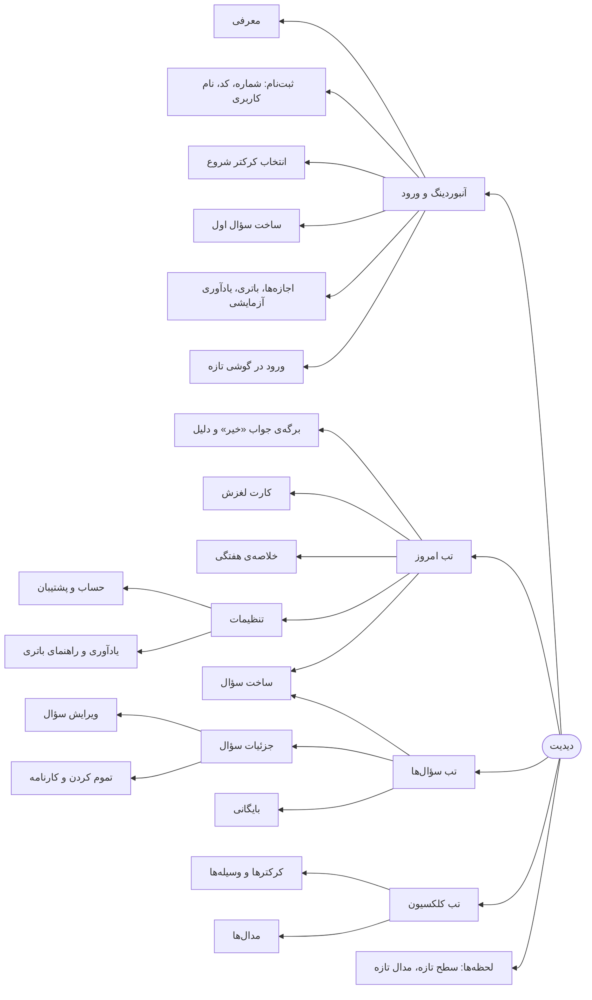

  <picture>
    <source media="(prefers-color-scheme: dark)" srcset="../02-brand/logo/svg/on-dark/lockup-fa-horizontal.svg">
    
  </picture>

# معماری اطلاعات

**نسخه:** ۰.۱ (پیش‌نویس) · **مرحله:** ۶ از ۱۳ (تفکر طراحی) · **قدم:** ۶ از ۷

> علامت ❓ یعنی تصمیمی که با طراح محصوله. علامت 🔬 یعنی جزئیاتی که در دیزاین (مرحله‌ی ۸) قطعی می‌شه.

---

## ۱. خلاصه

این سند می‌گه اپ چه صفحه‌هایی داره، هر صفحه چی نشون می‌ده و کاربر چطور بینشون جابه‌جا می‌شه. ورودی مستقیم **دیزاین سیستم** (مرحله‌ی ۷: کدوم کامپوننت‌ها لازمن) و **دیزاین** (مرحله‌ی ۸: وایرفریم هر صفحه) است.

**اعداد کلیدی:**
- **۲۴ صفحه و برگه:** ۱۰ آنبوردینگ و ورود، ۱۴ اصلی
- **۳ تب** در ناوبری اصلی (پیشنهاد)
- **۱ ویجت**
- **۱۰ نوع نوتیفیکیشن** ([فلوها](user-flows.md#۲-نوتیفیکیشنها))

---

## ۲. ناوبری اصلی

### پیشنهاد: سه تب، از راست به چپ

| تب | محتوا | چرا |
|---|---|---|
| **امروز** (پیش‌فرض) | پیشرفت، کرکتر کوچیک، سؤال‌های امروز | حلقه‌ی روزانه زیر ۱۰ ثانیه (اصل ۲)؛ پیشرفت قهرمان (D-051) |
| **سؤال‌ها** | همه‌ی سؤال‌های فعال و بایگانی‌شده، با آمار هر کدوم | جای جزئیات، تقویم و ویرایش |
| **کلکسیون** | کرکترها، وسیله‌ها، مدال‌ها، سطح | جای بازی، جدا از حلقه‌ی اصلی (بازی چاشنیه، [جمع‌بندی شواهد](research-synthesis.md)) |

- **تنظیمات** از آیکون بالای صفحه‌ی «امروز» باز می‌شه، نه از تب.
- **ساخت سؤال** با دکمه‌ی + در «امروز» و «سؤال‌ها».

**گزینه‌ی دیگه ❓:** تب چهارم «پیشرفت» برای آمار کلی و خلاصه‌ی هفتگی. پیشنهاد Claude: **نه**. پیشرفت کلی روی «امروز» و آمار هر سؤال در «سؤال‌ها» هست، و تب کمتر یعنی تصمیم کمتر برای کاربر.

### نقشه‌ی صفحه‌ها

---

## ۳. فهرست صفحه‌ها

### آنبوردینگ و ورود

| کد | صفحه | محتوا | فلو |
|---|---|---|---|
| S01 | معرفی | ۲ تا ۳ صفحه: یک سؤال در روز؛ «"خیر" هم حساب می‌شه و فریز زنجیره‌ت رو نگه می‌داره»؛ کرکتر. دکمه‌ی رد کردن | F1 |
| S02 | شماره موبایل | فیلد شماره، جمله‌ی حریم خصوصی، دکمه‌ی «حساب دارم» | F1 |
| S03 | کد تأیید | ۵ یا ۶ رقم 🔬، ارسال دوباره با شمارش معکوس | F1 |
| S04 | نام کاربری و رمز | دو فیلد، قوانین ساده‌ی رمز 🔬 | F1 |
| S05 | انتخاب کرکتر شروع | دو کرکتر، اسم‌گذاری اختیاری 🔬 | F1 |
| S06 | ساخت سؤال (چند قدم) | دسته ← زیردسته ← قالب یا متن ← روزها و ساعت ← بیشتر (بعد از چی؟ چرا؟) | F2 |
| S07 | اجازه‌ها | نوتیفیکیشن ← آلارم و یادآوری؛ هر کدوم با یک جمله‌ی دلیل | F1 |
| S08 | راهنمای باتری | قدم‌های مخصوص برند گوشی، با تصویر | F1 |
| S09 | یادآوری آزمایشی | «رسید؟» با دو دکمه | F1 |
| S10 | ورود | نام کاربری و رمز، یا شماره و کد؛ بازیابی پشتیبان | F9 |

### اصلی

| کد | صفحه | محتوا | فلو |
|---|---|---|---|
| S11 | **امروز** (صفحه‌ی اصلی) | بخش ۴ | F3، F4 |
| S12 | برگه‌ی «خیر» | پیام فریز یا بهترین زنجیره، دلیل اختیاری، گاهی «چرا» | F4 |
| S13 | کارت «در حال لغزش» | «ساعت یا روزها رو عوض کن»، «هدف رو کوچیک کن»، «فعلاً نه» | F6 |
| S14 | خلاصه‌ی هفتگی | پایبندی هفته، روزهای «بله»، مقایسه‌ی ملایم با هفته‌ی قبل، هدف بعدی | — |
| S15 | فهرست سؤال‌ها | سؤال‌های فعال با زنجیره و پایبندی هر کدوم؛ لینک بایگانی | — |
| S16 | جزئیات سؤال | متن، دسته، «چرا»، «بعد از چی»؛ تقویم ۳۰ روز از راست به چپ؛ زنجیره‌ی فعلی، بهترین زنجیره، پایبندی؛ مدال‌ها؛ شمارنده‌ی همراهان | F8 |
| S17 | ویرایش سؤال | همون فیلدهای ساخت؛ تغییر روزها و ساعت | F2، F6 |
| S18 | کارنامه | بهترین زنجیره، پایبندی کل، مدال‌ها؛ دکمه‌ی اشتراک | F7، F8 |
| S19 | بایگانی | سؤال‌های تمام‌شده با کارنامه؛ برگردوندن | F8 |
| S20 | کلکسیون | کرکتر فعلی، کرکترها و وسیله‌های باز و قفل، چیزی که در سطح بعد باز می‌شه، مدال‌ها | F7 |
| S21 | لحظه‌ی سطح تازه | انیمیشن، چیزی که باز شده | F7 |
| S22 | لحظه‌ی مدال تازه | مدال، XP، فاصله تا مدال بعدی، اشتراک | F7 |
| S23 | تنظیمات | حساب، یادآوری مجدد (روشن/خاموش)، پنهان کردن شمارنده‌ی همراهان (D-052)، راهنمای باتری، تم (روشن، تیره، سیستم)، پشتیبان و همگام‌سازی، حریم خصوصی، درباره | — |
| S24 | حساب و پشتیبان | نام کاربری، شماره، تغییر رمز، زمان آخرین همگام‌سازی، خروج | F9 |

### بیرون از اپ

| کد | جزء | محتوا |
|---|---|---|
| W1 | ویجت صفحه‌ی اصلی گوشی | سؤال‌های امروز با دکمه‌ی بله/خیر؛ پایبندی کوتاه (D-038) 🔬 |
| N | نوتیفیکیشن‌ها | ۱۰ نوع ([فلوها](user-flows.md#۲-نوتیفیکیشنها)) |

---

## ۴. صفحه‌ی «امروز»: ترتیب محتوا

مهم‌ترین صفحه‌ی اپ. ترتیب از بالا به پایین (D-051):

| # | بخش | محتوا | قانون |
|---|---|---|---|
| ۱ | سرصفحه | تاریخ شمسی امروز، آیکون تنظیمات | اعداد فارسی |
| ۲ | هشدار (فقط وقتی لازمه) | اجازه‌ی نوتیفیکیشن نیست، یا یادآوری دیروز نرسید | ملایم؛ با دکمه‌ی «درستش کن» |
| ۳ | **بخش پیشرفت** | **پایبندی ۳۰ روزه** (حلقه‌ی پیکسلی و «۲۲ روز از ۳۰»)؛ بهترین زنجیره‌ی فعال؛ امتیاز نظم؛ **کرکتر کوچیک** با سطح و نوار XP | پیشرفت پررنگ، کرکتر کنارش |
| ۴ | هدف بعدی | «۳ روز تا مدال ۲۱» | فقط نزدیک‌ترین مدال |
| ۵ | **سؤال‌های امروز** | کارت هر سؤال: متن، زنجیره، دکمه‌های بله و خیر، «فریز داری» وقتی هست | ترتیب: جواب‌داده‌نشده‌ها اول، بعد به ترتیب ساعت 🔬 |
| ۶ | کارت لغزش (فقط وقتی لازمه) | برای سؤال‌های «در حال لغزش» | — |
| ۷ | همراهان | «امروز ۱۲۴ نفر دیگه هم پیاده‌روی کردن» | فقط بالای ۲۰ نفر؛ قابل پنهان کردن |
| ۸ | دکمه‌ی + | ساخت سؤال | — |

**حالت‌های خاص:**

| حالت | چی نشون داده می‌شه |
|---|---|
| امروز سؤالی زمان‌بندی نشده | «امروز روز استراحته» و پیشرفت هفته |
| همه‌ی سؤال‌ها جواب گرفتن | پیام کوتاه تموم شدن روز، کرکتر خوشحال |
| آفلاین | همه‌چیز کار می‌کنه؛ فقط شمارنده با «آخرین به‌روزرسانی» (D-042) |
| کاربر تازه، کمتر از ۷ روز داده | پایبندی از روز اول حساب می‌شه، نه ۳۰ روز؛ متن «۳ روز از ۳ روز» 🔬 |

---

## ۵. اشیای داده

برای هماهنگی دیزاین و توسعه. هر شیء روی گوشی ذخیره و بعداً همگام می‌شه (D-042).

| شیء | ویژگی‌های اصلی | نمایش در |
|---|---|---|
| سؤال | متن، دسته (۳ سطح)، روزها، ساعت، بعد از چی، چرا، وضعیت (فعال، بایگانی) | S11، S15، S16 |
| جواب | سؤال، روز، بله یا خیر، دلیل «خیر»، زمان ثبت، منبع (نوتیفیکیشن، اپ، ویجت) | S11، S16 |
| روز فریز | تاریخ، سؤال‌های پوشش‌داده‌شده | S16، نوتیفیکیشن |
| زنجیره | فعلی و بهترین، برای هر سؤال | S11، S16 |
| مدال | سؤال، نوع (۷ تا ۳۶۵)، تاریخ | S16، S20، S22 |
| XP و سطح | کل XP، سطح، XP تا سطح بعد | S11، S20 |
| کرکتر و وسیله | باز یا قفل، سطح لازم، کرکتر فعال | S20 |
| امتیاز نظم | عدد کل، هیچ‌وقت زیر صفر | S11 |
| همراهان | تعداد در دسته، تعداد «بله»ی امروز، زمان آخرین به‌روزرسانی | S11، S16 |

---

## ۶. ورودی برای دیزاین سیستم (مرحله‌ی ۷)

کامپوننت‌هایی که این صفحه‌ها لازم دارن و باید در دیزاین سیستم تعریف بشن:

| گروه | کامپوننت‌ها |
|---|---|
| **ورودی** | دکمه‌ی بله و خیر (خیر هیچ‌وقت قرمز)، دکمه‌ی اصلی و فرعی، فیلد متن، فیلد کد تأیید، انتخاب روزهای هفته (شنبه تا جمعه، راست به چپ)، انتخاب ساعت، چیپ دسته و دلیل |
| **نمایش پیشرفت** | حلقه‌ی پیکسلی پایبندی، نوار ۳۰ روزه، تقویم ماهانه‌ی شمسی، شمارنده‌ی زنجیره، نوار XP، نشان سطح، مدال |
| **کارت‌ها** | کارت سؤال امروز (حالت‌های جواب‌نداده، بله، خیر، فریز، لغزش)، کارت لغزش، کارت هشدار، کارت هدف بعدی |
| **برگه‌ها و پنجره‌ها** | برگه‌ی پایینی (دلیل «خیر»)، پنجره‌ی لحظه‌ی سطح و مدال، برگه‌ی تأیید |
| **کرکتر** | نمایش کرکتر در اندازه‌های کوچیک و بزرگ، با ۵ حالت انیمیشن (D-035) |
| **ناوبری** | نوار تب پایین (۳ تب)، سرصفحه، دکمه‌ی + شناور |
| **سیستم** | نوتیفیکیشن با دکمه، ویجت، حالت خالی، حالت آفلاین، تم روشن و تیره |

---

## ۷. تاریخچه‌ی نسخه‌ها

| نسخه | تاریخ | تغییر |
|---|---|---|
| ۰.۱ | ۲۰۲۶-۱۰-۱۰ | پیش‌نویس اول |
