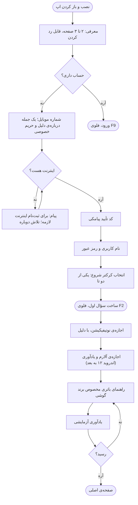
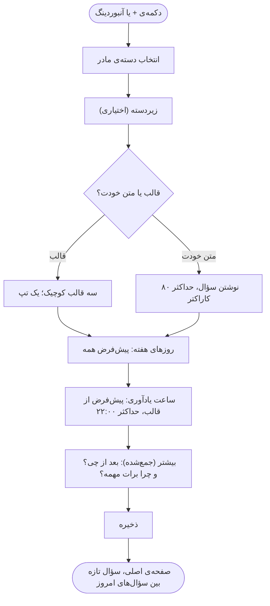
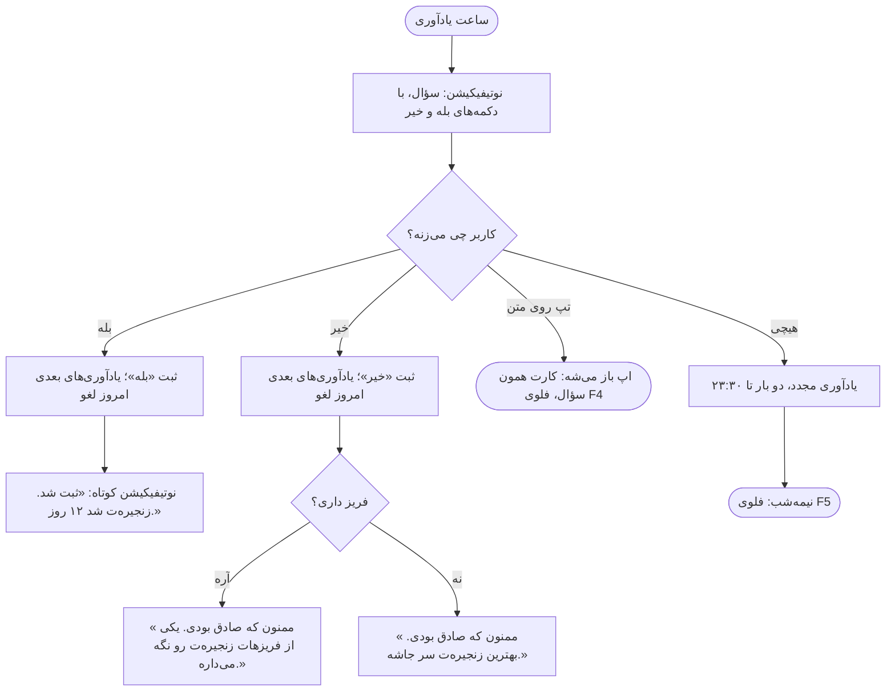
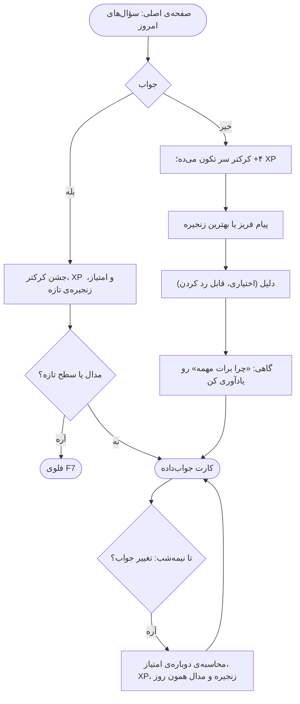
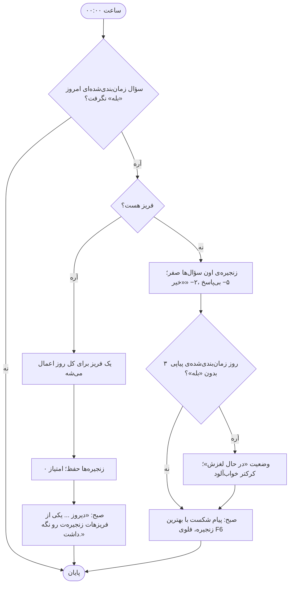
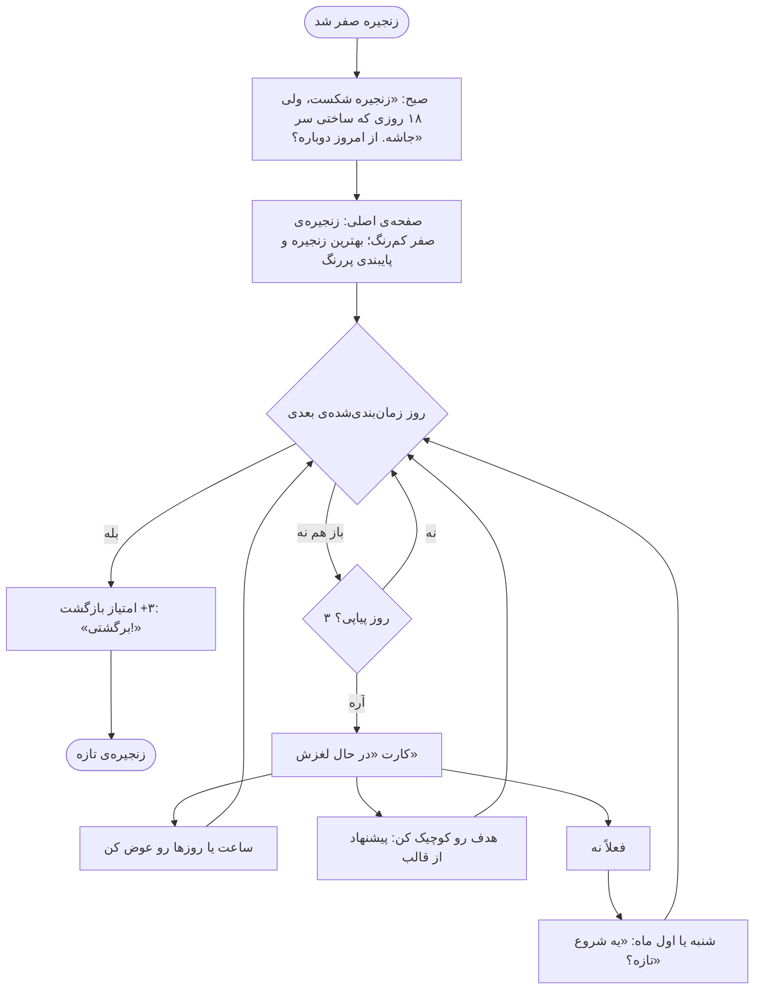
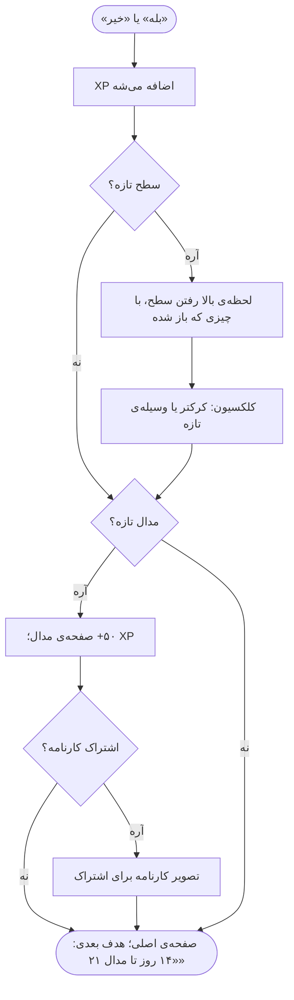
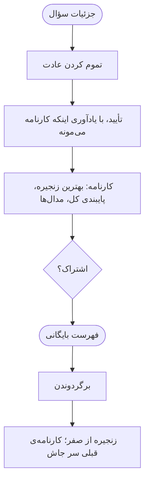
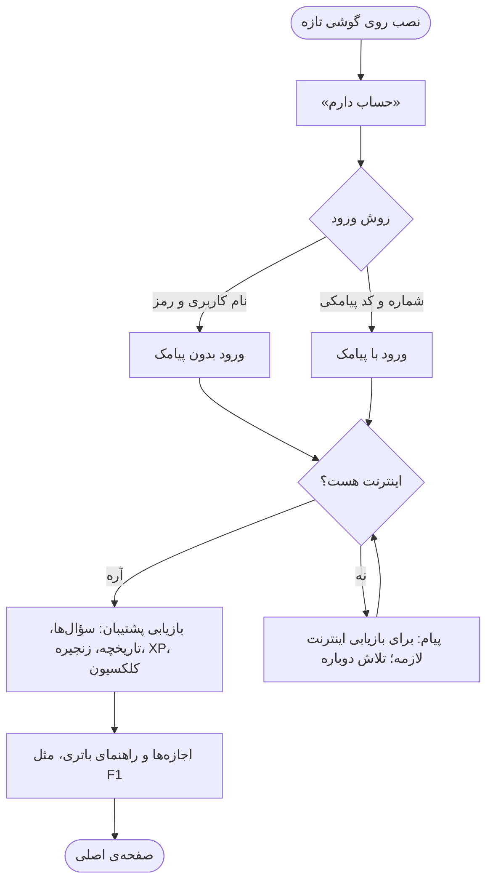

  <picture>
    <source media="(prefers-color-scheme: dark)" srcset="../02-brand/logo/svg/on-dark/lockup-fa-horizontal.svg">
    
  </picture>

# فلوهای کاربر

**نسخه:** ۰.۱ (پیش‌نویس) · **مرحله:** ۶ از ۱۳ (تفکر طراحی) · **قدم:** ۵ از ۷

> علامت 🔬 یعنی جزئیاتی که در طراحی (مرحله‌ی ۸) یا تست (مرحله‌ی ۹) قطعی می‌شه.

---

## ۱. خلاصه

نُه فلوی حیاتی MVP، هر کدوم با نمودار و قانون‌هایی که از [تفکر محصول](../03-product-thinking/product-thinking.md) و دفتر تصمیم‌ها میان. فلوها **رفتار** رو تعریف می‌کنن، نه ظاهر رو. ظاهر کار دیزاین سیستم (مرحله‌ی ۷) و دیزاین (مرحله‌ی ۸) است.

| # | فلو | لحظه در [سفر کاربر](journey-map.md) |
|---|---|---|
| F1 | آنبوردینگ و ثبت‌نام | روز ۰ |
| F2 | ساخت سؤال | روز ۰ و بعد |
| F3 | جواب از نوتیفیکیشن | هر روز |
| F4 | جواب و تغییر جواب داخل اپ | هر روز |
| F5 | پردازش نیمه‌شب (سیستم) | هر شب |
| F6 | شکست، لغزش و برگشت | بعد از شکست |
| F7 | سطح، مدال و کارنامه | نقطه‌های عطف |
| F8 | بایگانی و برگردوندن | پایان یک عادت |
| F9 | ورود در گوشی تازه | تعویض گوشی |

**قاعده‌های مشترک همه‌ی فلوها:**
- **آفلاین‌اول (D-042):** هیچ قدمی از حلقه‌ی روزانه منتظر اینترنت نمی‌مونه. فقط ثبت‌نام، ورود، پشتیبان‌گیری و شمارنده‌ی همراهان اینترنت می‌خوان.
- **«خیر» هیچ‌وقت قرمز نیست** و هیچ پیامی سرزنش نمی‌کنه ([پلتفرم برند](../02-brand/brand-platform.md)).
- **روز اپ** از ۰۰:۰۰ تا ۲۳:۵۹ به وقت گوشیه (D-022).

---

## F1. آنبوردینگ و ثبت‌نام

ثبت‌نام **قبل** از سؤال اول می‌مونه (D-020، D-055). یادآوری آزمایشی آخر آنبوردینگ اضافه شده (D-055).

| قدم | قانون |
|---|---|
| معرفی | حداکثر ۳ صفحه: ایده‌ی «یک سؤال در روز»، «"خیر" هم حساب می‌شه و فریز زنجیره‌ت رو نگه می‌داره» (D-052)، و کرکتر |
| شماره | ثبت‌نام با شماره و کد پیامکی (D-020)؛ متن کنار فیلد: «فقط برای حسابت. سؤال‌ها و جواب‌هات خصوصی‌ان.» |
| نام کاربری و رمز | برای ورود بدون پیامک در آینده (D-044) |
| کرکتر شروع | دو گزینه (سطح ۱، بخش ۴.۱۳ تفکر محصول) |
| اجازه‌ها | **بعد** از ساخت سؤال اول، تا دلیلشون معلوم باشه: «تا "امروز پیاده‌روی کردی؟" ساعت ۱۸ برسه» |
| اجازه رد شد | اپ کار می‌کنه؛ صفحه‌ی اصلی هشدار ملایم با دکمه‌ی «فعال کن» نشون می‌ده |
| راهنمای باتری | فقط برای برندهایی که اپ رو می‌بندن (سامسونگ، شیائومی، هوآوی و آنر)؛ با تصویر قدم‌ها 🔬 |
| یادآوری آزمایشی | یک نوتیفیکیشن تست چند ثانیه بعد. اگه نرسید، راهنمای باتری دوباره و لینک «کمک» |

---

## F2. ساخت سؤال

| قدم | قانون |
|---|---|
| دسته | یک دسته‌ی مادر اجباری، زیردسته‌ی دوم و سوم اختیاری ([درخت دسته‌ها](category-tree.md)) |
| قالب | سه قالب کوچیک برای هر زیردسته؛ قابل ویرایش بعد از انتخاب |
| متن | جوابش فقط بله یا خیر؛ حداکثر ۸۰ کاراکتر |
| هدف بزرگ | اگه متن نشونه‌ی هدف بزرگ داره (مثلاً «یک ساعت»)، پیشنهاد ملایم: «شروع کوچیک بهتر جواب می‌ده» 🔬 |
| روزها | پیش‌فرض همه‌ی روزها (D-004)؛ هفته از شنبه، راست به چپ |
| ساعت | دیرترین ساعت ۲۲:۰۰ (D-026) |
| بعد از چی؟ | لنگر موقعیتی اختیاری (D-045)؛ در متن یادآوری نشون داده می‌شه |
| چرا؟ | اختیاری (D-052)؛ گاهی در یادآوری یا بعد از «خیر» |
| زمان کل | با قالب، زیر یک دقیقه |

---

## F3. جواب از نوتیفیکیشن

| قانون | منبع |
|---|---|
| یادآوری مجدد دو بار، به فاصله‌ی مساوی تا ۲۳:۳۰ و حداکثر ۹۰ دقیقه؛ قابل خاموش کردن | D-034 |
| متن یادآوری چرخشیه: چند متن هم‌معنی با لحن برند، گاهی با «بعد از چی؟» یا «چرا» | D-045، D-052 |
| چند سؤال در یک ساعت: یک نوتیفیکیشن گروهی، هر سؤال با دکمه‌های خودش 🔬 | محدودیت سیستم‌عامل |
| دلیل «خیر» از روی نوتیفیکیشن پرسیده نمی‌شه؛ اگه کاربر بعداً اپ رو باز کنه، کارت دلیل اختیاری نشون داده می‌شه | D-027، اصل ۲ (زیر ۱۰ ثانیه) |
| جواب از نوتیفیکیشن بدون اینترنت ثبت می‌شه | D-042 |

---

## F4. جواب و تغییر جواب داخل اپ

| قانون | منبع |
|---|---|
| فقط برای امروز؛ جواب دادن به روزهای گذشته ممکن نیست | بخش ۴.۴ |
| تغییر جواب تا نیمه‌شب؛ مدالی که شرطش از بین رفت برداشته می‌شه | D-025 |
| پاداش بلافاصله و کوتاه؛ کل حلقه زیر ۱۰ ثانیه | اصل ۲ |
| قبل از «خیر»، وقتی فریز داری، روی کارت نوشته می‌شه: «فریز داری» | D-052 |

---

## F5. پردازش نیمه‌شب (سیستم)

این فلو بدون دخالت کاربر و روی خود گوشی اجرا می‌شه (D-042).

| قانون | منبع |
|---|---|
| فریز هم برای بی‌پاسخ و هم برای «خیر» | D-040 |
| یک فریز همه‌ی سؤال‌های بدون «بله»ی اون روز رو پوشش می‌ده | D-024 |
| ۲ فریز در ماه؛ اول هر ماه شمسی تمدید، بدون ذخیره | D-034 |
| فریز روی درصد پایبندی اثر نداره | D-040 |
| امتیاز کل هیچ‌وقت زیر صفر نمی‌ره | بخش ۴.۷ |
| اول ماه: فریزها تمدید و پیام کوتاه «دو فریز تازه داری» | D-034 🔬 (متن) |

---

## F6. شکست، لغزش و برگشت

| قانون | منبع |
|---|---|
| بهترین زنجیره هیچ‌وقت کم نمی‌شه | بخش ۴.۵ |
| زنجیره‌ی شکسته از نظر بصری کم‌رنگ | D-045 |
| امتیاز بازگشت: «بله» در اولین روز زمان‌بندی‌شده بعد از شکست | D-004 |
| «در حال لغزش» بعد از ۳ روز پیاپی، خروج با اولین «بله» | D-034 |
| پیام شروع تازه در شنبه، اول ماه شمسی و نوروز | تحقیق کتابخانه‌ای (شروع تازه) |
| هیچ ترمیم زنجیره‌ای وجود نداره | D-049 |

---

## F7. سطح، مدال و کارنامه

| قانون | منبع |
|---|---|
| مدال‌ها: ۷، ۲۱، ۳۰، ۶۶، ۱۰۰ و ۳۶۵ روز؛ ۶۶ ویژه | D-038، D-055 |
| همیشه فاصله تا مدال بعدی نشون داده می‌شه | تحقیق کتابخانه‌ای (هدف نزدیک) |
| بعد از مدال ۶۶: پیشنهاد کم کردن یادآوری | D-045 |
| کارنامه فقط با انتخاب کاربر به اشتراک گذاشته می‌شه؛ بدون متن سؤال، مگر کاربر بخواد 🔬 | اصل ۵ (حریم خصوصی) |
| سطح و وسیله‌ها هیچ‌وقت پس گرفته نمی‌شن | D-035 |

---

## F8. بایگانی و برگردوندن

| قانون | منبع |
|---|---|
| سؤال بایگانی‌شده یادآوری نداره و در آمار امروز نیست | بخش ۴.۱۲ |
| برگردوندن ممکنه، با زنجیره‌ی تازه | بخش ۴.۱۲ |

---

## F9. ورود در گوشی تازه

| قانون | منبع |
|---|---|
| ورود با نام کاربری و رمز، وقتی پیامک نمی‌رسه | D-044 |
| فراموشی رمز: بازیابی با پیامک | D-044 |
| زنجیره و تاریخچه هیچ‌وقت با تعویض گوشی گم نمی‌شن | آنالیز رقبا (شکایت گم شدن داده) |

---

## ۲. نوتیفیکیشن‌ها

فهرست همه‌ی نوتیفیکیشن‌های MVP. همه **محلی**‌ان و بدون اینترنت کار می‌کنن (D-001، D-042).

| نوتیفیکیشن | کِی | دکمه‌ها | فلو |
|---|---|---|---|
| یادآوری سؤال | ساعت انتخابی | بله، خیر | F3 |
| یادآوری مجدد | دو بار تا ۲۳:۳۰ | بله، خیر | F3 |
| تأیید جواب | بعد از جواب از نوتیفیکیشن | — | F3 |
| فریز اعمال شد | صبح بعد | — | F5 |
| زنجیره شکست | صبح بعد | — | F6 |
| در حال لغزش | بعد از ۳ روز | — | F6 |
| شروع تازه | شنبه یا اول ماه، برای سؤال‌های در حال لغزش | — | F6 |
| فریزهای تازه | اول ماه شمسی | — | F5 |
| خلاصه‌ی هفتگی | آخر هفته 🔬 (جمعه شب؟) | — | — |
| یادآوری آزمایشی | آنبوردینگ | — | F1 |

**سقف:** کاربر در یک روز عادی بیشتر از ۳ نوتیفیکیشن برای هر سؤال نمی‌گیره (یادآوری + ۲ مجدد) 🔬.

---

## ۳. تاریخچه‌ی نسخه‌ها

| نسخه | تاریخ | تغییر |
|---|---|---|
| ۰.۱ | ۲۰۲۶-۱۰-۱۰ | پیش‌نویس اول |
