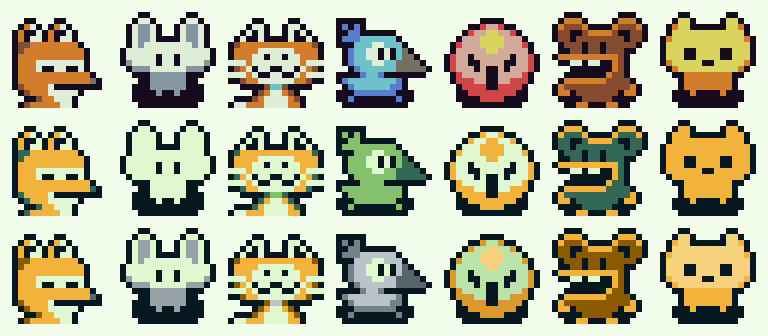

  <picture>
    <source media="(prefers-color-scheme: dark)" srcset="../02-brand/logo/svg/on-dark/lockup-fa-horizontal.svg">
    
  </picture>

# کرکترها

**نسخه:** ۰.۱ (پیش‌نویس) · **مرحله:** ۷ از ۱۳ (دیزاین سیستم) · [صفحه‌ی انتخاب](https://claude.ai/artifact/JM4KBx5EyVazMasQeogWsv)

این سند تصمیم موکول‌شده‌ی D-037 رو جلو می‌بره: کدوم کرکترها، با چه رنگی، در چه اندازه‌ای و با چه ترتیبی باز می‌شن. **انتخاب نهایی با طراح محصوله**؛ Claude صفحه‌ی انتخاب و قواعد استفاده رو ساخته (D-058).

---

## ۱. خلاصه

- **کاندیدها:** ۸۴ کرکتر ۱۶×۱۶ در دو مجموعه ([کاندیدها](../02-brand/characters/candidates/README.md)). ۹ مورد پرچم دارن: ۸ ترسناک و ۱ شبیه Minecraft.
- **جایگاه‌ها:** ۶ کرکتر انتشار اول (D-036): دو کرکتر شروع، و کرکترهای سطح ۳، ۵، ۸ و ۱۰ (ویژه‌ی «عادت شد»).
- **رنگ:** دو پیشنهاد برای تبدیل به پالت برند؛ طراح یکی رو انتخاب می‌کنه.
- **روند:** طراح در [صفحه‌ی انتخاب](https://claude.ai/artifact/JM4KBx5EyVazMasQeogWsv) جایگاه‌ها رو پر می‌کنه و «ذخیره» می‌زنه؛ Claude انتخاب رو می‌خونه و این سند و فایل‌های کرکتر رو نهایی می‌کنه.
- **پیش از استفاده:** بررسی لایسنس (بخش ۶).

---

## ۲. جایگاه‌ها و ترتیب باز شدن

از جدول باز شدن در [تفکر محصول](../03-product-thinking/product-thinking.md) (بخش ۴.۱۳):

| جایگاه | کِی باز می‌شه | زمان تقریبی با یک «بله»ی روزانه | معیار پیشنهادی انتخاب |
|---|---|---|---|
| **شروع ۱ و ۲** | سطح ۱ (کاربر یکی رو انتخاب می‌کنه، S05) | روز اول | دوست‌داشتنی و خنثی؛ دو حس متفاوت (مثلاً یکی آروم، یکی پرانرژی) |
| **سطح ۳** | ۶۰ XP | حدود روز ۶ | اولین «جایزه»؛ باید زود دیده بشه |
| **سطح ۵** | ۲۰۰ XP | حدود ۲ هفته | نقطه‌ی ریزش (روز ۱۴)؛ کرکتر جذاب‌تر |
| **سطح ۸** | ۵۶۰ XP | حدود ۶ هفته | — |
| **سطح ۱۰** | ۹۰۰ XP | حدود ۷۰ روز، نزدیک مدال ۶۶ | ویژه‌ی «عادت شد»؛ خاص‌ترین کرکتر |

**معیارها** (از D-035 تا D-037):
1. **موضوع:** حیوان‌ها و موجودات (D-036). مجموعه‌ی B حیوان بیشتری داره.
2. **لحن:** گرم و دوست‌داشتنی؛ بدون اسکلت و موجود ترسناک.
3. **حقوقی:** شبیه کرکترهای شناخته‌شده (Minecraft) نباشه.
4. **خوانایی در اندازه‌ی کوچیک:** در ۴۸dp (ضریب ۳) هنوز معلوم باشه چیه.
5. **رنگ برند:** بعد از تبدیل رنگ، شخصیتش رو از دست نده.

---

## ۳. رنگ‌آمیزی برند

قاعده‌ی [هویت بصری](../02-brand/visual-identity.md#۷۱-کرکترها-d-035) می‌گه کرکترها فقط با پالت برند کشیده می‌شن. کاندیدها ۱۶ رنگ دارن (پالت DawnBringer 16)، پس هر رنگ به یک رنگ برند نگاشت می‌شه. دو پیشنهاد:

<small>ردیف بالا رنگ اصلی، وسط «برند ۵ رنگ»، پایین «برند گسترده». از چپ: B-05، B-16، B-33، B-30، B-35، A-38، B-12.</small>

| رنگ اصلی | برند ۵ رنگ | برند گسترده |
|---|---|---|
| مشکی | شب | شب |
| سفید | جوانه | جوانه |
| پوست | جوانه | سبز ۲۰۰ |
| خاکستری روشن | جوانه | خنثی ۴۰۰ |
| آبی، فیروزه‌ای | برگ | خنثی ۵۰۰، خنثی ۳۰۰ |
| سبز | برگ | برگ |
| سبز تیره | جنگل | جنگل |
| خاکستری‌های تیره، آبی تیره، بنفش تیره | جنگل | خنثی ۶۰۰ تا ۸۰۰، سبز ۹۰۰ |
| قهوه‌ای | جنگل | طلایی تیره (`#8A5A00`) |
| قرمز، نارنجی، زرد | طلا | سه درجه‌ی طلا 🔬 |

- **برند ۵ رنگ:** دقیقاً قاعده‌ی هویت بصری، حس گیم‌بوی، هم‌خانواده با لوگو. بعضی کرکترها (به‌خصوص آبی‌ها) شبیه هم می‌شن.
- **برند گسترده:** از طیف‌های سبز و خنثی‌ی پالت هم استفاده می‌کنه؛ شخصیت هر کرکتر بیشتر می‌مونه. ⚠️ دو درجه‌ی تازه‌ی طلا (`#D99A2B` و `#F7D27E`) در پالت نیستن و اگه انتخاب بشن، به پالت اضافه و در فهرست تصمیم‌ها ثبت می‌شن.
- **اصلی** فقط برای مقایسه‌ست؛ استفاده‌ش قاعده‌ی برند رو می‌شکنه.

نگاشت‌ها در [`tools/design-system/character_palettes.py`](../../tools/design-system/character_palettes.py) هستن و تبدیل خودکاره. طراح می‌تونه برای هر کرکتر نگاشت دستی بخواد (یادداشت در صفحه‌ی انتخاب).

---

## ۴. استفاده در اپ

| جا | اندازه | زمینه | حالت‌ها |
|---|---|---|---|
| پنل کرکتر در «امروز» | ۹۶dp (ضریب ۶) | پلاک `surface-tint` پیکسلی | ایستاده، جشن، همراهی، خواب‌آلود |
| کارت سؤال در حال لغزش، کارت لغزش | ۴۸dp (ضریب ۳) | بدون پلاک | خواب‌آلود |
| کلکسیون | ۹۶dp | کاشی پیکسلی؛ قفل‌ها سیلوئت `track` | ایستاده |
| انتخاب کرکتر شروع (S05) | ۱۶۰dp (ضریب ۱۰) | پلاک `surface-tint` | ایستاده، جشن بعد از انتخاب |
| لحظه‌ی سطح تازه (S21) | ۱۶۰dp | کارت لحظه | بالا رفتن سطح |
| حالت خالی | ۹۶dp | بدون پلاک | ایستاده یا جشن |

**قاعده‌ها:**
- **فقط ضریب صحیح** و بدون نرم کردن لبه‌ها (`FilterQuality.none`).
- **تم تیره:** کرکتر همیشه روی پلاک `surface-tint` تیره (`#1D423D`) می‌شینه، چون خط دور شب کرکتر روی زمینه‌ی شب گم می‌شه. در صفحه‌ی انتخاب، ستون «پلاک تیره» همین حالته.
- **هیچ حالت غمگین یا تنبیهی** (D-035). «همراهی» بعد از «خیر» یعنی سر تکون دادن آروم.

### انیمیشن‌های نیم‌تنه

چون کاندیدها نیم‌تنه‌ان، انیمیشن‌ها با جابه‌جایی پیکسل‌ها روی همون تصویر ساخته می‌شن، نه حرکت دست و پا:

| حالت | فریم‌ها | حرکت |
|---|---|---|
| ایستاده | ۴ | بالا و پایین رفتن ۱ پیکسل (نفس کشیدن) + پلک زدن هر چند ثانیه |
| جشن | ۴ | دو پرش ۲ پیکسلی + چند پیکسل جرقه‌ی طلایی دور سر |
| همراهی | ۴ | کج شدن سر ۱ پیکسل به دو طرف |
| خواب‌آلود | ۲ | چشم‌های نیمه‌بسته (یک ردیف پیکسل) + «z» پیکسلی |
| بالا رفتن سطح | ۶ | پرش + قاب طلایی که پیکسل‌به‌پیکسل دورش ساخته می‌شه |

سرعت `motion.sprite-fps` (۶ فریم در ثانیه). چشم‌ها و دهن هر کرکتر جای متفاوتی دارن، پس فریم‌های پلک و خواب برای هر کرکتر جدا کشیده می‌شن (Claude، بعد از انتخاب نهایی).

---

## ۵. وسیله‌ها و نیم‌تنه بودن

D-035 و D-036 «۱۲ وسیله‌ی مشترک روی همه‌ی کرکترها» رو فرض کرده بودن، با قالب بدن کامل ۳۲×۳۲. کاندیدها نیم‌تنه‌ی ۱۶×۱۶ان و شکل سرشون فرق داره، پس کلاه و لباس مشترک روشون نمی‌شینه.

**پیشنهاد Claude** ❓ (تصمیم با طراح محصول):

| گزینه | توضیح | هزینه |
|---|---|---|
| **الف. وسیله‌های کنار کرکتر** (پیشنهادی) | به‌جای پوشیدنی: **قاب پلاک** (۴ نوع)، **پس‌زمینه‌ی پلاک** (۴ نوع)، **همراه کوچیک** ۸×۸ کنار کرکتر (۴ نوع). همه روی هر کرکتری کار می‌کنن | کم؛ مستقل از شکل کرکتر |
| ب. وسیله‌ی جدا برای هر کرکتر | کلاه یا عینک مخصوص هر کرکتر | زیاد؛ ۶ × ۲ = ۱۲ طرح جدا و دیگه مشترک نیستن |
| ج. فقط کرکتر، بدون وسیله | سطح‌های ۲، ۴، ۶، ۷، ۹ چیز دیگه‌ای باز می‌کنن (مثلاً تم رنگی) | کم؛ ولی جدول باز شدن عوض می‌شه |

---

## ۶. لایسنس (قبل از استفاده)

هر دو مجموعه از یک طراح («Dzhioeva Anastasiia») و ظاهراً از یک سایت فروش تصویرن ([کاندیدها](../02-brand/characters/candidates/README.md#یادداشتها-برای-مرحلهی-۷)). قبل از انتشار، طراح محصول این‌ها رو در لایسنس خریداری‌شده چک می‌کنه:

- [ ] استفاده داخل اپ موبایل (محصول تجاری)
- [ ] تغییر رنگ و ساختن فریم‌های انیمیشن از روی طرح
- [ ] استفاده در آیتم‌های پولی اشتراک (D-021)
- [ ] استفاده در فروشگاه‌ها و تبلیغات (آیکون، تصویر صفحه‌ی فروشگاه)
- [ ] نیاز به ذکر نام طراح در اپ

این مجموعه‌ها انحصاری نیستن؛ اپ‌های دیگه هم ممکنه همین کرکترها رو داشته باشن.

---

## ۷. تاریخچه‌ی نسخه‌ها

| نسخه | تاریخ | تغییر |
|---|---|---|
| ۰.۱ | ۲۰۲۶-۱۰-۱۰ | پیش‌نویس اول و صفحه‌ی انتخاب |
