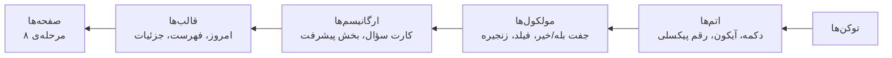

<p align="center">
  <picture>
    <source media="(prefers-color-scheme: dark)" srcset="../02-brand/logo/svg/on-dark/lockup-fa-horizontal.svg">
    
  </picture>
</p>

# دیزاین سیستم دیدیت

**نسخه:** ۰.۱ (پیش‌نویس) · **مرحله:** ۷ از ۱۳ (دیزاین سیستم)

این سند نقطه‌ی شروع دیزاین سیستمه: اصول، ساختار، قاعده‌ی سبک پیکسلی ترکیبی و نقشه‌ی فایل‌ها. جزئیات در چهار سند دیگه هست:

| سند | محتوا |
|---|---|
| [پایه‌ها](foundations.md) | توکن‌ها: رنگ، تایپوگرافی، اعداد پیکسلی، فاصله، شکل، سایه، حرکت، آیکون، چیدمان |
| [کامپوننت‌ها](components.md) | اتم‌ها، مولکول‌ها، ارگانیسم‌ها و قالب‌ها، با حالت‌ها و توکن‌های هر کدوم |
| [راست‌به‌چپ، تم تیره و دسترس‌پذیری](accessibility.md) | قواعد جهت، تم، کنتراست، اندازه‌ی متن، صفحه‌خوان و حرکت |
| [کرکترها](characters.md) | روند انتخاب، رنگ‌آمیزی برند، اندازه‌ها، حالت‌ها و جایگاه‌ها |

**صفحه‌های تعاملی:**
- [کامپوننت‌ها](https://claude.ai/artifact/3sSuWEtZGgnKJcAGbh33Kt): همه‌ی کامپوننت‌ها و حالت‌هاشون، در تم روشن و تیره
- [انتخاب کرکترها](https://claude.ai/artifact/JM4KBx5EyVazMasQeogWsv): ۸۴ کاندید، دو پیشنهاد رنگ، ۶ جایگاه انتشار اول

---

## ۱. خلاصه

- **سازنده:** کل ساختار، توکن‌ها و تعامل‌ها رو Claude ساخته؛ طراح محصول بازبینی و تأیید می‌کنه (D-058).
- **ساختار:** Atomic Design، از اتم تا قالب. صفحه‌ها در مرحله‌ی ۸ از همین قالب‌ها ساخته می‌شن.
- **سبک:** پیکسلی ترکیبی. اجزای «بازی» پیکسلی‌ان؛ اجزای «خوندن و نوشتن» ساده.
- **پایه‌ی فنی:** کامپوننت‌های اختصاصی Flutter با پیشوند `Dd`، بدون ظاهر Material.
- **منبع حقیقت:** فایل‌های توکن JSON. خروجی CSS و Dart با اسکریپت از روی اون‌ها ساخته می‌شن و دستی ویرایش نمی‌شن.
- **اندازه‌ی کار:** ۱۷۴ توکن، ۵۰ آیکون، ۱۱ رقم پیکسلی، ۴۴ کامپوننت در ۴ سطح.

---

## ۲. اصول

این اصول از [اصول طراحی](../06-design-thinking/research-synthesis.md) و [راهنمای هویت بصری](../02-brand/visual-identity.md) میان و هر تصمیم دیزاین سیستم باید باهاشون جور باشه:

1. **صداقت از شکست مهم‌تره.** «خیر» هیچ‌وقت قرمز نیست و هیچ جزئی حس تنبیه نمی‌ده. دکمه‌ی «خیر» خنثی‌ست، کرکتر غمگین نمی‌شه، و رنگ خطا فقط برای خطای سیستم‌ه.
2. **حلقه‌ی روزانه زیر ۱۰ ثانیه.** کارت سؤال و دکمه‌های بله/خیر بزرگ‌ترین هدف لمسی صفحه‌ان و بدون باز کردن صفحه‌ی دیگه کار می‌کنن.
3. **پیشرفت قهرمانه (D-051).** اعداد پایبندی و زنجیره با رقم‌های پیکسلی بزرگ نشون داده می‌شن؛ بازی (کرکتر و XP) کنارشه، نه جلوش.
4. **پیکسل جایی که لذت می‌ده، سادگی جایی که باید خوند.**
5. **یک منبع، دو خروجی.** هر مقدار بصری یک توکن داره؛ صفحه‌ی HTML و اپ Flutter از یک فایل ساخته می‌شن.

---

## ۳. قاعده‌ی سبک پیکسلی ترکیبی (D-058)

| پیکسلی | ساده و خوانا |
|---|---|
| دکمه‌ها (اصلی، فرعی، بله، خیر، شناور) | متن‌ها و عنوان‌ها (Estedad) |
| کارت‌ها و برگه‌ها | فیلدهای متن و کد |
| نوار پیشرفت، حلقه‌ی پایبندی، زنجیره، تقویم | فهرست‌ها و ردیف‌های تنظیمات |
| مدال، نشان سطح، نوار XP | سوییچ، انتخاب ساعت |
| کرکتر و آیکون‌ها | نوار تب پایین (آیکون پیکسلی، زمینه‌ی ساده) |
| اعداد بزرگ (رقم‌های پیکسلی) | اعداد داخل متن (Estedad با ارقام فارسی) |

**نشانه‌های پیکسلی:** گوشه‌ی پله‌ای، خط دور ۲dp رنگ `outline`، سایه‌ی سخت ۴dp رو به پایین، و حرکت پله‌ای.
**نشانه‌های ساده:** گوشه‌ی صاف بدون پله، لبه‌ی ۲dp رنگ `border`، بدون سایه، و حرکت کوتاه.

---

## ۴. سطح‌های Atomic Design



| سطح | تعریف در دیدیت | تعداد | نمونه |
|---|---|---|---|
| **توکن** | مقدارهای پایه، بدون شکل | ۱۷۴ | `theme.light.yes`، `space.4`، `motion.duration.fast` |
| **اتم** | کوچک‌ترین جزء قابل استفاده؛ داده‌ی محصول نمی‌شناسه | ۱۳ | `DdButton`، `DdIcon`، `DdPixelNumber` |
| **مولکول** | چند اتم با یک کار مشخص | ۱۳ | `DdAnswerPair`، `DdChainStrip`، `DdOtpField` |
| **ارگانیسم** | بخش کامل صفحه که داده‌ی محصول (سؤال، جواب، XP) می‌گیره | ۱۴ | `DdQuestionCard`، `DdProgressHero`، `DdNoSheet` |
| **قالب** | چیدمان صفحه با جای ارگانیسم‌ها، بدون داده‌ی واقعی | ۴ | قالب «امروز»، قالب فهرست، قالب جزئیات، قالب آنبوردینگ |

فهرست کامل و مشخصات هر کامپوننت در [کامپوننت‌ها](components.md).

---

## ۵. نقشه‌ی فایل‌ها

| مسیر | محتوا | ساخته با |
|---|---|---|
| [`../02-brand/tokens.json`](../02-brand/tokens.json) | رنگ‌های برند، تم‌های پایه، سیستم پیکسلی، فونت (مرحله‌ی ۲) | دستی |
| [`tokens/tokens.json`](tokens/tokens.json) | نقش‌های رنگی تازه، فاصله، اندازه، شکل، سایه، تایپوگرافی، حرکت، ابعاد کامپوننت‌ها | دستی |
| [`tokens/tokens.css`](tokens/tokens.css) | متغیرهای CSS با پیشوند `--dd-` و تم روشن و تیره | `tools/design-system/build_tokens.py` |
| [`tokens/didit_tokens.dart`](tokens/didit_tokens.dart) | ثابت‌های Flutter: `DdColors.light/dark`، `DdType`، `DdSpace` و ... | همون |
| [`tokens/tokens.resolved.json`](tokens/tokens.resolved.json) | همه‌ی توکن‌ها با مقدار نهایی | همون |
| [`icons/`](icons/icons.json) | ۵۰ آیکون SVG (۴۸ از Pixelarticons، ۲ اختصاصی) و لایسنس MIT | `tools/design-system/icons.py` |
| [`numerals/`](numerals/numerals.json) | رقم‌های پیکسلی فارسی: SVG، JSON و Dart | `tools/design-system/pixel_numerals.py` |
| `build/design-system/` | دو صفحه‌ی تعاملی (در گیت نیست) | `tools/design-system/build_pages.py` |

**ساختن دوباره:**

```bash
python3 tools/design-system/build_tokens.py --check   # توکن‌ها + گزارش کنتراست
python3 tools/design-system/pixel_numerals.py --preview
python3 tools/design-system/build_pages.py            # صفحه‌های تعاملی
```

---

## ۶. پیاده‌سازی در Flutter

- **بدون Material:** اپ روی `WidgetsApp` ساخته می‌شه، نه `MaterialApp`. ویجت‌های پایه (`GestureDetector`، `Semantics`، `CustomPaint`، `Text`) مستقیم استفاده می‌شن تا ظاهر سیستمی (Ripple، گردی، سایه‌ی محو) وارد نشه.
- **تم:** یک `InheritedWidget` به اسم `DdTheme` که `DdColors.light` یا `DdColors.dark` رو می‌ده. انتخاب: روشن، تیره یا سیستم (S23).
- **شکل پیکسلی:** یک `ShapeBorder` اختصاصی (`DdStepBorder`) که گوشه‌ی پله‌ای و خط دور رو می‌کشه، و یک `DdHardShadow` که همون شکل رو ۴dp پایین‌تر با رنگ `shadow` می‌کشه.
- **پیکسل‌آرت:** `FilterQuality.none` و ضریب صحیح. اعداد پیکسلی و کرکترها با `CustomPainter` از روی داده‌ی ردیف‌ها کشیده می‌شن؛ آیکون‌ها با `flutter_svg`.
- **فونت:** Estedad داخل اپ بسته‌بندی می‌شه (بدون دانلود از Google Fonts، به خاطر دسترسی از ایران).
- **راست‌به‌چپ:** `Directionality` از زبان اپ میاد؛ کامپوننت‌ها فقط از `EdgeInsetsDirectional` و `AlignmentDirectional` استفاده می‌کنن.
- **ترجمه:** هیچ متنی داخل کامپوننت‌ها نیست؛ همه از `arb` میان (قواعد آینده‌ی کد).

---

## ۷. روند کار و تغییر

1. Claude کامپوننت یا توکن تازه رو در JSON و سند اضافه می‌کنه و صفحه‌ی تعاملی رو دوباره می‌سازه.
2. طراح محصول روی صفحه‌ی تعاملی بازبینی می‌کنه.
3. تغییرهای مهم (رنگ تازه، تغییر قاعده‌ی برند) در [فهرست تصمیم‌ها](../00-decision-log.md) ثبت می‌شن.
4. نسخه‌ی این سند و صفحه‌ی تعاملی با هم بالا می‌رن.

**چیزهای باز برای طراح محصول:**
- تأیید شکل رقم‌های پیکسلی، به‌خصوص ۴ و ۶ ([پایه‌ها](foundations.md#۳-اعداد-پیکسلی))
- تأیید خط دور سبز در تم تیره به‌جای مشکی ([دسترس‌پذیری](accessibility.md#۲-تم-تیره))
- انتخاب ۶ کرکتر و رنگ نهایی در [صفحه‌ی انتخاب](https://claude.ai/artifact/JM4KBx5EyVazMasQeogWsv)
- جایگزین وسیله‌های پوشیدنی برای کرکترهای نیم‌تنه ([کرکترها](characters.md#۵-وسیلهها-و-نیمتنه-بودن))

---

## ۸. تاریخچه‌ی نسخه‌ها

| نسخه | تاریخ | تغییر |
|---|---|---|
| ۰.۱ | ۲۰۲۶-۱۰-۱۰ | پیش‌نویس اول |
