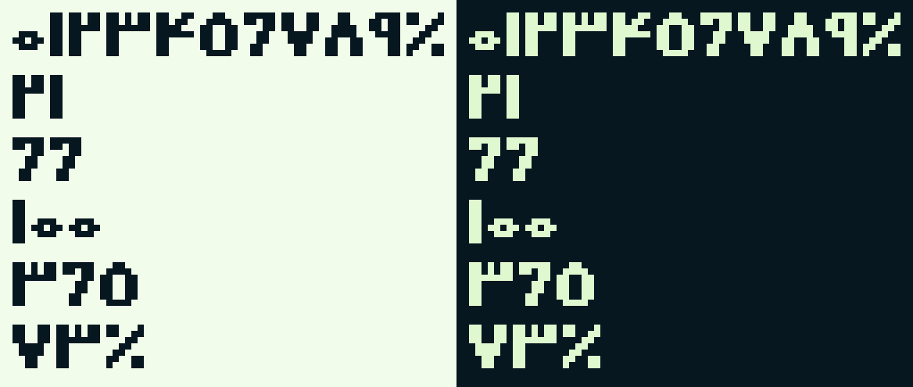

  <picture>
    <source media="(prefers-color-scheme: dark)" srcset="../02-brand/logo/svg/on-dark/lockup-fa-horizontal.svg">
    
  </picture>

# پایه‌ها (Foundations)

**نسخه:** ۰.۱ (پیش‌نویس) · **مرحله:** ۷ از ۱۳ (دیزاین سیستم)

همه‌ی مقدارهای بصری اپ، به‌صورت توکن. منبع: [`../02-brand/tokens.json`](../02-brand/tokens.json) (مرحله‌ی ۲) و [`tokens/tokens.json`](tokens/tokens.json) (این مرحله). اسم هر توکن در CSS با `--dd-` و در Flutter با کلاس‌های `Dd` میاد؛ مثلاً `space.4` می‌شه `--dd-space-4` و `DdSpace.s4`.

---

## ۱. رنگ

### نقش‌ها

ویجت‌ها فقط نقش‌ها رو می‌شناسن، نه کد رنگ رو. پالت پایه (شب، برگ، جوانه، جنگل، طلا و دو طیف سبز و خنثی) در [پالت](../02-brand/palette.md) هست.

| نقش | کاربرد | روشن | تیره |
|---|---|---|---|
| `bg` | زمینه‌ی صفحه | `#F1FCEA` | `#061720` |
| `surface` | کارت، برگه، فیلد | `#FFFFFF` | `#0F1E26` |
| `surface-tint` | سطح ملایم برند، انتخاب‌شده | `#DFF8CF` | `#1D423D` |
| `text` | متن اصلی | `#061720` | `#DFF8CF` |
| `text-muted` | متن فرعی | `#58656D` | `#B9C3C9` |
| `outline` ‡ | خط دور پیکسلی | `#061720` | `#4C825E` |
| `border` | لبه‌ی اجزای ساده، جداکننده | `#D6DEE3` | `#3C4A52` |
| `primary` | دکمه‌ی اصلی | `#85C06C` | `#85C06C` |
| `on-primary` | متن روی دکمه‌ی اصلی | `#061720` | `#061720` |
| `primary-pressed` | دکمه‌ی اصلی فشرده | `#659E65` | `#9ED088` |
| `yes` | دکمه و خونه‌ی «بله» | `#85C06C` | `#85C06C` |
| `yes-text` | متن سبز «بله» و لینک | `#346856` | `#85C06C` |
| `no-text` | متن دکمه‌ی «خیر» | `#58656D` | `#B9C3C9` |
| `no-border` | لبه‌ی دکمه‌ی «خیر» | `#758188` | `#758188` |
| `focus` | حلقه‌ی فوکوس | `#061720` | `#DFF8CF` |
| `medal` | مدال و XP | `#F2B33D` | `#F2B33D` |
| `medal-text` | متن طلایی، آیکون هشدار | `#8A5A00` | `#F2B33D` |
| `error` | فقط خطای سیستم | `#B83A30` | `#FF8A7A` |
| `surface-sunken` ✦ | زمینه‌ی فرورفته، برچسب خنثی | `#E8EEF1` | `#223038` |
| `surface-pressed` ✦ | جزء ساده‌ی فشرده | `#DFF8CF` | `#102A2D` |
| `track` ✦ | بخش خالی نوار و حلقه | `#D6DEE3` | `#3C4A52` |
| `scrim` ✦ | پرده‌ی پشت برگه و پنجره | `#0617207A` | `#000000A3` |
| `disabled-bg` ✦ | زمینه‌ی غیرفعال | `#E8EEF1` | `#223038` |
| `disabled-text` ✦ | متن غیرفعال | `#758188` | `#758188` |
| `chain-yes` ✦ | روز «بله» | `#85C06C` | `#85C06C` |
| `chain-freeze` ✦ | روز فریز | `#DFF8CF` | `#1D423D` |
| `chain-no` ✦ | روز «خیر» | `#D6DEE3` | `#3C4A52` |
| `chain-off` ✦ | روز بدون برنامه | `#E8EEF1` | `#223038` |
| `xp-fill` ✦ | پر شدن نوار XP | `#F2B33D` | `#F2B33D` |
| `on-medal` ✦ | متن روی طلا | `#061720` | `#061720` |
| `highlight` ✦ | نور ۲dp بالای دکمه‌ی اصلی | `#DFF8CF` | `#DFF8CF` |
| `shadow` ✦ | سایه‌ی سخت | `#061720` | `#000000` |

✦ نقش تازه در این مرحله · ‡ مقدار تیره در این مرحله عوض شد: خط دور مشکی روی زمینه‌ی «شب» کنتراست ۱٫۱۵ داشت و کارت‌ها در تم تیره از زمینه جدا نمی‌شدن. سبز ۶۰۰ کنتراست ۴٫۰۵ داره و مثل خط دور لوگوی زمینه‌ی تیره سبزه ([دسترس‌پذیری](accessibility.md#۲-تم-تیره)).

### قاعده‌های رنگ

- **«خیر» هیچ‌وقت قرمز نیست.** `error` فقط برای خطای سیستم (ارسال نشدن کد، قطع شبکه موقع ثبت‌نام) و دکمه‌ی کار برگشت‌ناپذیر.
- **سبز یعنی انجام‌شده یا برند**، طلا یعنی پاداش (مدال، XP، سطح). هشدار ملایم با آیکون و متن طلایی تیره، نه رنگ تازه.
- **نسبت در یک صفحه:** حدود ۶۰٪ زمینه‌ی روشن، ۲۵٪ شب، ۱۰٪ برگ، ۵٪ جوانه و طلا ([هویت بصری](../02-brand/visual-identity.md#۳-رنگ)).
- **شفافیت** فقط در `scrim`. حالت غیرفعال با رنگ جدا ساخته می‌شه، نه با کم کردن شفافیت.

---

## ۲. تایپوگرافی

فونت **Estedad** (D-017) داخل اپ بسته‌بندی می‌شه. همه‌ی سبک‌ها ارقام هم‌عرض (`tabular-nums`) دارن.

| توکن | اندازه / ارتفاع خط | وزن | کاربرد |
|---|---|---|---|
| `type.display` | ۳۲ / ۴۴ | ۹۰۰ | عنوان لحظه‌ی جشن |
| `type.question` | ۲۲ / ۳۶ | ۸۰۰ | متن سؤال روی کارت |
| `type.title-1` | ۲۰ / ۳۲ | ۷۰۰ | عنوان صفحه |
| `type.title-2` | ۱۷ / ۲۸ | ۷۰۰ | عنوان کارت و برگه |
| `type.answer` ✦ | ۱۸ / ۲۸ | ۸۰۰ | دکمه‌های بله و خیر |
| `type.button` ✦ | ۱۶ / ۲۴ | ۷۰۰ | دکمه‌ها |
| `type.body` | ۱۵ / ۲۶ | ۴۰۰ | متن اصلی |
| `type.small` | ۱۳ / ۲۲ | ۵۰۰ | توضیح و متن فرعی |
| `type.label` | ۱۲ / ۲۰ | ۶۰۰ | برچسب، چیپ |

- **اندازه‌ی متن سیستم:** همه‌ی سبک‌ها با تنظیم اندازه‌ی متن گوشی بزرگ می‌شن تا ۲ برابر ([دسترس‌پذیری](accessibility.md#۳-دسترسپذیری)).
- **اعداد داخل متن** فارسی‌ان («۳ روز تا مدال ۲۱»). اعداد بزرگ با رقم پیکسلی (بخش ۳).
- **عدد نمایشی ۳۲ با Estedad** فقط جایی که رقم پیکسلی جا نمی‌شه (مثلاً متن طولانی کنار عدد).

---

## ۳. اعداد پیکسلی

رقم‌های فارسی پیکسلی برای عددهای قهرمان: زنجیره، پایبندی، سطح، XP در لحظه‌ی جشن، عدد مدال (D-058). شبکه از نوشتار فارسی لوگو گرفته شده: **۷ ردیف ارتفاع، خط عمودی ۲ واحد پهن، خط افقی ۱ واحد**.

| توکن | واحد | ارتفاع | کاربرد |
|---|---|---|---|
| `size.numeral-unit.sm` | ۳dp | ۲۱dp | عدد کاشی آمار، عدد روی مدال |
| `size.numeral-unit.md` | ۴dp | ۲۸dp | وسط حلقه‌ی پایبندی، عدد زنجیره روی کارت |
| `size.numeral-unit.lg` | ۶dp | ۴۲dp | بخش پیشرفت، کارنامه |
| `size.numeral-unit.xl` | ۸dp | ۵۶dp | لحظه‌ی مدال و سطح تازه |

- **ارقام همیشه چپ‌به‌راست** چیده می‌شن (رقم بزرگ‌تر سمت چپ)، حتی داخل متن راست‌به‌چپ. فاصله‌ی بین رقم‌ها ۱ واحد.
- **فقط ضریب صحیح.** واحد عدد صحیحی از dp‌ه و رندر بدون نرم کردن لبه‌ها.
- **دسترس‌پذیری:** عدد پیکسلی تصویره؛ همیشه یک برچسب متنی برای صفحه‌خوان داره («زنجیره‌ی ۲۱ روزه»).
- **فایل‌ها:** [`numerals/numerals.json`](numerals/numerals.json) (داده‌ی ردیف‌ها)، [`numerals/didit_numerals.dart`](numerals/didit_numerals.dart) و SVG هر رقم در [`numerals/svg/`](numerals/svg/).
- **باز برای طراح:** شکل ۴ و ۶ در این اندازه‌ی کوچیک ساده شده؛ اگه به فرم دست‌نویس نزدیک‌تر لازمه، فقط داده‌ی ردیف‌ها عوض می‌شه.

---

## ۴. فاصله و اندازه

**واحد پیکسل ۴dp‌ه** و همه‌ی فاصله‌ها مضرب ۴ان.

| توکن | مقدار | کاربرد رایج |
|---|---|---|
| `space.1` | ۴ | فاصله‌ی آیکون و برچسب کوچیک |
| `space.2` | ۸ | فاصله‌ی داخل چیپ و ردیف |
| `space.3` | ۱۲ | فاصله‌ی دکمه‌های بله و خیر، داخل کارت |
| `space.4` | ۱۶ | **حاشیه‌ی کناری صفحه**، فاصله‌ی داخلی کارت |
| `space.5` | ۲۰ | فاصله‌ی افقی داخل دکمه |
| `space.6` | ۲۴ | فاصله‌ی بین بخش‌های صفحه، داخل برگه |
| `space.8` | ۳۲ | فاصله‌ی بخش‌های بزرگ |
| `space.10`، `space.12`، `space.16` | ۴۰، ۴۸، ۶۴ | صفحه‌های خالی و لحظه‌ها |

| توکن | مقدار | توضیح |
|---|---|---|
| `size.touch-min` | ۴۸ | حداقل هدف لمسی |
| `size.icon.md` / `lg` / `xl` | ۲۴ / ۳۶ / ۴۸ | هر پیکسل آیکون ۲، ۳ یا ۴dp |
| `size.character.sm` / `md` / `lg` | ۴۸ / ۹۶ / ۱۶۰ | کرکتر ۱۶ پیکسلی با ضریب ۳، ۶، ۱۰ |
| `size.content-max` | ۴۸۰ | حداکثر عرض محتوا در تبلت |

ابعاد هر کامپوننت (ارتفاع دکمه، فیلد، چیپ، تب و ...) در گروه `component` در [`tokens.json`](tokens/tokens.json) هست.

---

## ۵. شکل و سایه

| توکن | مقدار | قاعده |
|---|---|---|
| `shape.notch` | ۴ | گوشه‌ی پله‌ای دو پله‌ای (هر پله ۲dp) برای کارت، دکمه و برگه |
| `shape.notch-sm` | ۲ | گوشه‌ی یک پله‌ای برای چیپ، برچسب و خونه‌ها |
| `shape.outline` | ۲ | خط دور پیکسلی، رنگ `outline` |
| `shape.border` | ۲ | لبه‌ی اجزای ساده، رنگ `border`، گوشه‌ی صاف |
| `shape.divider` | ۱ | جداکننده‌ی ردیف‌های فهرست |
| `elevation.rest` | ۴ | سایه‌ی سخت رو به پایین، بدون محو شدن، رنگ `shadow` |
| `elevation.low` | ۲ | چیپ، برچسب و کاشی کوچیک |
| `elevation.pressed` | ۰ | جزء ۴dp پایین می‌ره و سایه‌ش حذف می‌شه |

- **گردی (radius) صفره.** هیچ جزئی گوشه‌ی گرد نداره؛ پیکسلی‌ها پله‌ای و ساده‌ها صاف.
- **سایه فقط برای اجزای پیکسلی**، همیشه رو به پایین (نه به سمت شروع یا پایان)، پس در راست‌به‌چپ هم عوض نمی‌شه.
- **برگه‌ی پایینی** فقط گوشه‌های بالاش پله‌ای‌ان و سایه نداره؛ پرده‌ی `scrim` و خط دور جداش می‌کنن.

---

## ۶. حرکت

| توکن | مقدار | کاربرد |
|---|---|---|
| `motion.duration.fast` | ۸۰ms | فشردن، سوییچ |
| `motion.duration.base` | ۱۲۰ms | تغییر حالت، انتخاب چیپ |
| `motion.duration.slow` | ۲۰۰ms | باز شدن برگه، ورود کارت |
| `motion.duration.check` | ۴۸۰ms | ساخته شدن تیک بعد از «بله» |
| `motion.duration.celebrate` | ۱۲۰۰ms | لحظه‌ی سطح و مدال |
| `motion.steps.short` / `long` | ۲ / ۴ | تعداد پله در `steps()` برای حرکت‌های کوتاه و بلند |
| `motion.sprite-fps` | ۶ | فریم در ثانیه‌ی کرکتر (مجاز ۴ تا ۸) |

- **حرکت پله‌ای:** جابه‌جایی‌ها با پله‌های ۴dp و منحنی `steps()`، نه حرکت نرم. استثنا: کشیدن برگه با انگشت که باید دنبال انگشت بیاد.
- **کاهش حرکت:** با تنظیم «کاهش حرکت» سیستم، همه‌ی مدت‌ها `instant` می‌شن و کرکتر روی فریم اول می‌مونه.
- **لرزش:** «بله» ضربه‌ی سبک، «خیر» کلیک انتخاب، لحظه‌ی جشن ضربه‌ی متوسط. هیچ‌وقت لرزش خطا برای «خیر».

---

## ۷. آیکون‌ها

**[Pixelarticons](https://github.com/halfmage/pixelarticons)** نسخه‌ی ۲.۴.۲، لایسنس MIT (D-058). شبکه‌ی ۲۴ با گام ۲، یعنی همون شبکه‌ی ۱۲×۱۲ پیکسل برند ([هویت بصری](../02-brand/visual-identity.md#۶-آیکونها)). دو آیکون نبود و Claude با همون قواعد کشید: `medal` و `offline`.

- رنگ آیکون از متن والد میاد (`currentColor`)؛ آیکون‌های سه‌رنگ برای لحظه‌های برند بعداً در مرحله‌ی ۸ ساخته می‌شن.
- فقط اندازه‌های ۲۴، ۳۶ و ۴۸.
- **آیکون‌های جهت‌دار** (`back`، `forward`) در زبان‌های چپ‌به‌راست برعکس می‌شن؛ بقیه هیچ‌وقت.
- لایسنس در [`icons/LICENSE-pixelarticons.txt`](icons/LICENSE-pixelarticons.txt) و فهرست در [`icons/icons.json`](icons/icons.json).

| آیکون | منبع | کاربرد |
|---|---|---|
| `today` | Pixelarticons: home | تب امروز |
| `questions` | Pixelarticons: list-box | تب سؤال‌ها |
| `collection` | Pixelarticons: backpack | تب کلکسیون |
| `settings` | Pixelarticons: settings-cog | تنظیمات |
| `add` | Pixelarticons: plus | ساخت سؤال |
| `yes` | Pixelarticons: check | بله، انجام شد |
| `close` | Pixelarticons: close | بستن |
| `back` | Pixelarticons: chevron-right | برگشت (در راست‌به‌چپ رو به راست) |
| `forward` | Pixelarticons: chevron-left | بعدی، ورود به جزئیات |
| `expand` | Pixelarticons: chevron-down | باز کردن |
| `reminder` | Pixelarticons: bell | یادآوری |
| `reminder-off` | Pixelarticons: bell-off | یادآوری خاموش |
| `calendar` | Pixelarticons: calendar | تقویم |
| `time` | Pixelarticons: clock | ساعت |
| `alarm` | Pixelarticons: alarm-clock | آلارم و یادآوری دقیق |
| `streak` | Pixelarticons: fire | زنجیره |
| `freeze` | Pixelarticons: snowflake | فریز |
| `trophy` | Pixelarticons: trophy | کارنامه، بهترین زنجیره |
| `level` | Pixelarticons: crown | سطح |
| `xp` | Pixelarticons: zap | امتیاز تجربه |
| `goal` | Pixelarticons: target | هدف بعدی |
| `why` | Pixelarticons: note | «چرا برات مهمه؟» |
| `share` | Pixelarticons: share | اشتراک |
| `edit` | Pixelarticons: pencil | ویرایش |
| `archive` | Pixelarticons: archive | بایگانی |
| `delete` | Pixelarticons: trash | حذف |
| `info` | Pixelarticons: info-box | توضیح |
| `warning` | Pixelarticons: warning-diamond | هشدار ملایم |
| `help` | Pixelarticons: circle-question | راهنما |
| `sync` | Pixelarticons: refresh | همگام‌سازی |
| `cloud` | Pixelarticons: cloud | پشتیبان |
| `lock` | Pixelarticons: lock | قفل (کرکتر و وسیله) |
| `account` | Pixelarticons: user | حساب |
| `companions` | Pixelarticons: users | همراهان |
| `show` | Pixelarticons: eye | نمایش |
| `hide` | Pixelarticons: eye-off | پنهان کردن |
| `battery` | Pixelarticons: battery-low | راهنمای باتری |
| `phone` | Pixelarticons: phone | شماره موبایل |
| `password` | Pixelarticons: key | رمز |
| `theme-dark` | Pixelarticons: moon | تم تیره |
| `theme-light` | Pixelarticons: sun | تم روشن |
| `celebrate` | Pixelarticons: sparkles | لحظه‌ی جشن |
| `gift` | Pixelarticons: gift | باز شدن وسیله |
| `chart` | Pixelarticons: chart-bar-big | خلاصه‌ی هفتگی |
| `more` | Pixelarticons: more-vertical | گزینه‌های بیشتر |
| `undo` | Pixelarticons: undo | برگردوندن جواب |
| `logout` | Pixelarticons: logout | خروج |
| `language` | Pixelarticons: languages | زبان |
| `medal` | didit (custom) | مدال |
| `offline` | didit (custom) | آفلاین |

---

## ۸. چیدمان

- **صفحه:** حاشیه‌ی کناری `space.4`، فاصله‌ی بخش‌ها `space.6`، یک ستون. در تبلت، محتوا حداکثر ۴۸۰dp و وسط‌چین.
- **ناحیه‌ی امن:** نوار تب و دکمه‌ی اصلی چسبیده به پایین، فاصله‌ی ناحیه‌ی امن گوشی رو اضافه می‌کنن.
- **ترتیب لایه‌ها (`z`):** محتوا ۰، سرصفحه‌ی چسبان ۱۰، دکمه‌ی شناور ۲۰، برگه ۳۰، پنجره ۴۰، پیام کوتاه ۵۰.
- **عرض‌های هدف:** ۳۶۰dp (عرض رایج گوشی‌های اندرویدی کوچیک) تا ۴۳۰dp؛ همه‌ی کامپوننت‌ها در ۳۲۰dp هم بدون اسکرول افقی کار می‌کنن 🔬.

---

## ۹. تاریخچه‌ی نسخه‌ها

| نسخه | تاریخ | تغییر |
|---|---|---|
| ۰.۱ | ۲۰۲۶-۱۰-۱۰ | پیش‌نویس اول |
